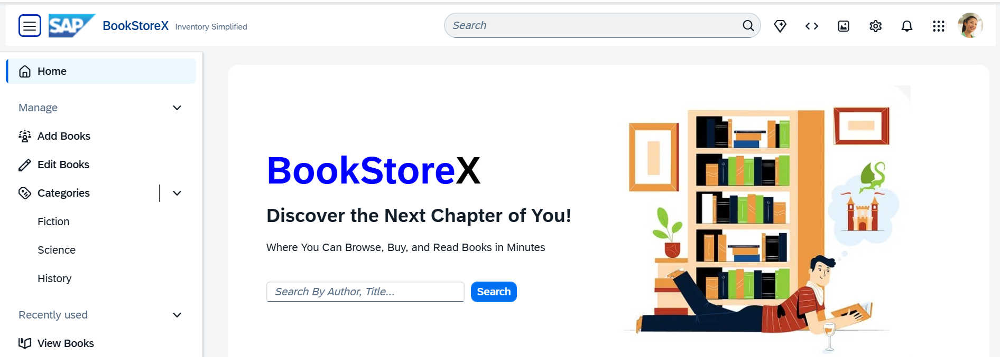
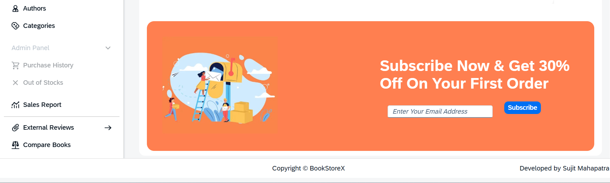

<h1 align="center"><b>📚BookStoreX</b></h1>
<h3 align="center"><b><i>Book Store App, Fiori UI, CAPM Services & CRUD Opeartions</i></b></h3>

---

---

It contains these folders and files, following our recommended project layout:

File or Folder | Purpose
---------|----------
`app/` | content for UI frontends goes here
`db/` | your domain models and data go here
`srv/` | your service models and code go here
`package.json` | project metadata and configuration
`readme.md` | this getting started guide

## Next Steps

- Open a new terminal and run `cds watch`
- (in VS Code simply choose _**Terminal** > Run Task > cds watch_)
- Start adding content, for example, a [db/schema.cds](db/schema.cds).

---

## 🤝 Contributing  
Contributions are welcome! Feel free to **fork** the repo and submit a **pull request**.  

---

## 📩 Contact  

  
  &nbsp;&nbsp;&nbsp;
  
  &nbsp;&nbsp;&nbsp;
  

---

⭐ **If you like this project, don't forget to star the repo!** ⭐
